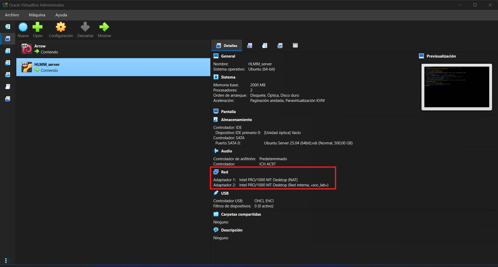
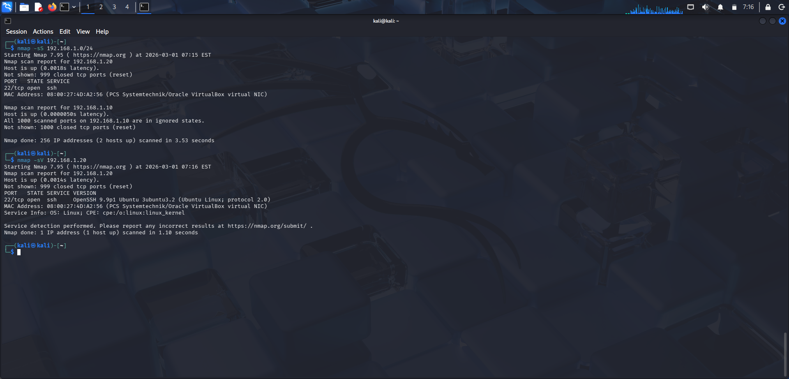
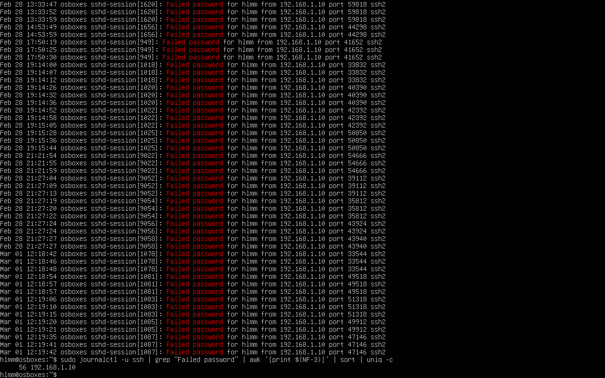
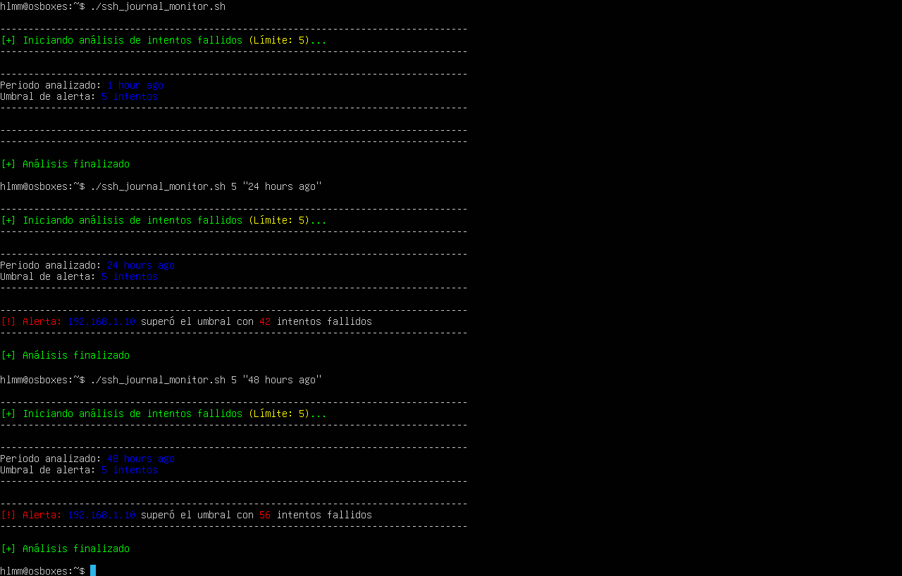

# Mini SOC Lab – SSH Monitoring

## Objective
Simulación de laboratorio SOC para detección de intentos de fuerza bruta SSH usando `journalctl` y Bash.

## Architecture
- Kali Linux: atacante
- Ubuntu Server: víctima
- Red interna aislada en VirtualBox

## Scenario
- Escaneo de red con Nmap
- Intentos fallidos de SSH
- Detección manual y automatizada con Bash
- Registro y documentación de incidente

## Tools
- Kali Linux
- Ubuntu Server
- SSH
- Bash, grep, awk, sort
- journalctl
- VirtualBox

## Evidence

